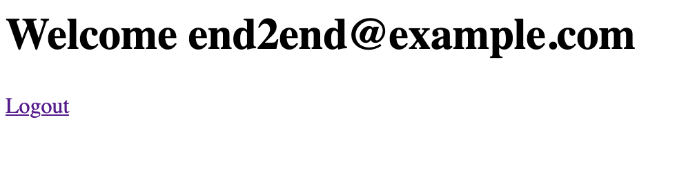

# Example App

This directory contains a Dash App that demonstrates how this package can be used.

## Prerequisites

You need a Cognito User Pool with an appropriately configured app client.
If you don't already have one, check out the CloudFormation template in [aws_resources.yaml](aws_resources.yaml).
It deploys the following resources:

- Cognito User Pool
- Cognito App Client
- Cognito Custom Domain (for the Hosted UI)

Once you have deployed the User Pool, create a `.env` file with this content and replace the placeholders with your values:

```bash
COGNITO_DOMAIN=<Your Cognito Domain>
COGNITO_REGION=<Your Cognito Region>
COGNITO_OAUTH_CLIENT_ID=<Your Cognito App Client Id>
COGNITO_OAUTH_CLIENT_SECRET=<Your Cognito App Client Secret>
```

Aside from `dash-cognito-auth`, we'll need the `python-dotenv` package to read that file, install it like this:

```shell
pip install python-dotenv
```

## Running the app

Now that we've prepared everything, it's time to start the app.

```shell
python app.py
```

The terminal wil show you how to access it, probably http://localhost:8050/ - when you access it, you'll be redirected to Cognito. Go ahead and log in (or create a user first) and once that's done, you'll be redirected back to the sample app.

You should then see something like this:



It isn't pretty, but you can see who's currently logged in.
Additionally, you can click on Logout, which will redirect you to the local `/logout` endpoint and then to Cognito, so both your local session and the Cognito sessions are ended. In the end you'll end up at the Cognito Login page again.

## Explore the code

Fortunately the implementation is rather simple. If you take a look at the `app.py` in this directory, you'll find that most of the code is about parsing the Cognito Configuration from the environment variables.

The main things you need to do are:

- Somehow fetch your configuration data
- Wrap your app with the `CognitoOAuth` object
- Set a secret_key on the Flask server